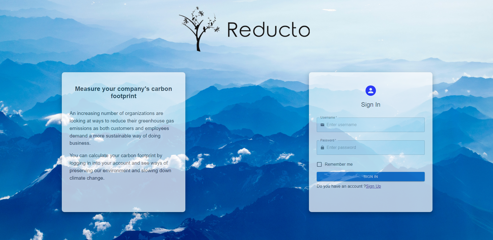

# Reducto

## Demo Link 
*https://carbon-reducto.netlify.app/*{:target=”_blank”}

&nbsp

## Table of Contents 

&nbsp

## Technologies Used 
- HTML
- CSS
- JavaScript
- React
- Material UI
- Python 
- Flask
- MongoDB

&nbsp

## Deployment
- Heroku
- Netlify

&nbsp

## Screenshots 

&nbsp

&nbsp

> Created by
[@agiskorska](https://github.com/agiskorska)
[@edisemin](https://github.com/edisemin)
[@ioanagh27](https://github.com/ioanagh27)
[@Jason Paul Brooks](https://github.com/madCakes)
[@Mike Mercieca](https://github.com/Mike-Mercieca)
